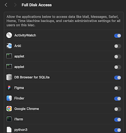

# Screen Thyme


a tiny library designed to automate of exporting Apple Screen Time and/or ActivityWatch data to a PostgreSQL database.

## Benefits

- Exporting without worrying about the device's status (on or off) through the use of Launchd instead of cron.
- Have more than 2 weeks worth of screentime data as Apple only stores 2 weeks.

## Installation

```bash
pip install screen_thyme
```

## Prerequisites

- Installation of [ActivityWatch](https://github.com/ActivityWatch/activitywatch)
- Enable screen time statistics on device

## Usage

```python3
import os

from dotenv import find_dotenv, load_dotenv

from screen_thyme.loader import LaunchdManager

# provide secrets in .env file or hardcode
load_dotenv(find_dotenv())
APPLE_PATH = os.getenv(key="APPLE_PATH")
AW_PATH = os.getenv(key="AW_PATH")
PG_URL = os.getenv(key="PG_URL")


if __name__ == "__main__":
    env_vars = {"APPLE_PATH": APPLE_PATH, "AW_PATH": AW_PATH, "PG_URL": PG_URL}

    m = LaunchdManager(
        env_vars=env_vars,
        path=os.path.dirname(os.path.realpath(__file__)),
    )
    m.create_plist()
    m.unload_job()
    m.load_job()
```

After creating job you need to enable full disk access for python since screentime is protected by SIP.



### Debug

You can debug the launchd job using the following commands:

```bash
cat /tmp/local.job.out
cat /tmp/local.job.err
launchctl list | grep io.screen.thyme
launchctl load -w io.screen.thyme.plist
launchctl unload -w io.screen.thyme.plist
```

## Roadmap

- Enable ways to export only apple data or activity watch
- Add tests
- Find a better way to create a python3 file within python3
- Find a better way to store secrets instead of adding to plist
- Look at more efficent ways to move data
  - <https://github.com/sfu-db/connector-x>
  - <https://github.com/psycopg/psycopg/issues/316>
- Push wheel to pypi

## Resources

- <https://apple.stackexchange.com/questions/435496/launchd-service-logs>
- <https://www.launchd.info/>
